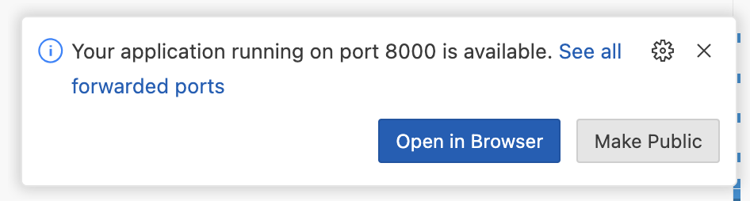

# MASER - Measles Simulation for ERadication

Spatial measles models implemented with the LASER toolkit.

## Setup for Development

### Codespace

In your fresh Codespace:

```bash
pip install -e .[dev]
uv tool install tox --with tox-uv
```

This will install `uv` and `tox` including configuring `tox` to use `uv` to setup the different Python versions against which we test.

Your Codespace editor should also have the Ruff linter installed. VSCode in the browser automagically saves your files for you. If you still explicitly save your file, the Ruff linter will run and make sure that `tox -e check` later does not fail on linter issues.

Viewing the code coverage report:

```bash
python3 -m http.server --directory htmlcov &
```

You should get a pop-up in the lower right corner of the browser window indicating that the system has detected the web server listening on port 8000. Selecting "Open in Browser" will open another browser tab connected to your web server serving up the code coverage report.



If you have reason to shut down the webserver, bring it to the foreground with `fg` and then stop it with `Ctrl+c`.
